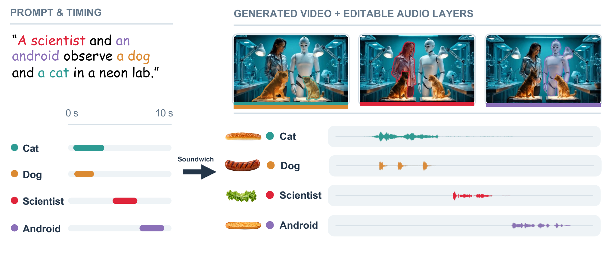
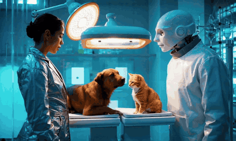
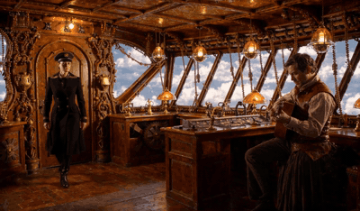
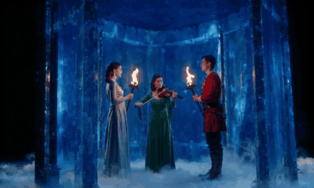
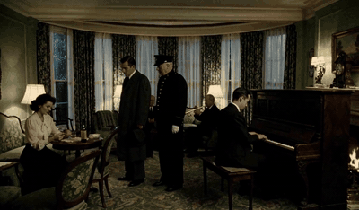

<div align="center">


# Soundwich

### Video Generation with Layered and Controllable Audio

<a href="https://arxiv.org/abs/XXXX.XXXXX"></a>
<a href="https://soundwich.avdemo.workers.dev/"></a>
<a href="https://pub-238c8a4431a4476c8eb0f5bd97a3846e.r2.dev/media/demo/20260926/video.mp4"></a>
<a href="LICENSE"></a>



</div>

Joint audio-video models synthesize a video with **one mixed soundtrack**. Real audiovisual work keeps speech,
music, effects, and ambience on **separate tracks**. Soundwich is a **training-free** method that turns a frozen joint
audio-video model into a generator of multiple synchronized audio stems around one shared video. You control what
each source sounds like and when it plays. The result can then be retimed, muted, replaced, or remixed one stem at a time.

https://github.com/user-attachments/assets/abda9d46-dbcc-4728-9311-83ea6d1ce177

<div align="center"><sub>Demo with sound (7:44) · <a href="https://pub-238c8a4431a4476c8eb0f5bd97a3846e.r2.dev/media/demo/20260926/video.mp4">full-length demo (10:48)</a> · more examples with per-stem playback on the <a href="https://soundwich.avdemo.workers.dev/">project page</a></sub></div>

## Gallery

<sub>Silent previews. Every clip below was generated as separate audio stems plus one video. Listen to the stems on the <a href="https://soundwich.avdemo.workers.dev/">project page</a>.</sub>

<table>
  <tr>
    <td align="center" width="33%"><br><sub><b>Neon Biology Lab</b> · LTX-2.5<br>scientist, android, dog, cat</sub></td>
    <td align="center" width="33%"><br><sub><b>Clockwork Airship</b> · LTX-2.5<br>door knock, footsteps, guitar, captain</sub></td>
    <td align="center" width="33%"><br><sub><b>Crystal Court Violin</b> · LTX-2.5<br>ruler, guard, violin</sub></td>
  </tr>
  <tr>
    <td align="center" width="33%"><br><sub><b>The Unrented Room</b> · MiniMax H3<br>three voices, piano, trumpet, rain, fire, clock, knocks</sub></td>
    <td align="center" width="33%"><br><sub><b>The Wrong Stop</b> · MiniMax H3<br>traveler, partner, train ambience, guitar</sub></td>
    <td align="center" width="33%"><br><sub><b>Ticket Counter</b> · Ovi 1.1<br>passenger and clerk, scheduled turns</sub></td>
  </tr>
</table>

## How it works

Soundwich runs inside the sampler of a frozen model. No weights are trained or fine-tuned.

| | Component | What it does |
|---|---|---|
| 🍞 | **Stem formation** | Expands the single audio trajectory into *N* source stems that share one video trajectory. Each stem gets its own source prompt and a source-specific negative prompt that excludes competing sounds. |
| ⏱️ | **Carrier replay** | Replays cached *activation* and *quiet* attention features inside and outside each source's requested time windows, so every stem follows its timeline. |
| 🥬 | **Scene broadcast** | An internal scene stem gathers the shared acoustic context from all sources, then broadcasts it back so separately generated stems still sound like one room. |
| 🎯 | **Entity routing** | SAM 3 masks connect each stem to its on-screen source in audio-to-video and video-to-audio attention, so the right person's lips move with the right voice. |

## Supported backbones

| Backbone | Separate stems | Source-specific guidance | Timeline control | Scene broadcast | Entity routing | Folder |
|---|:---:|:---:|:---:|:---:|:---:|---|
| [LTX-2.5](https://github.com/Lightricks/LTX-2) | ✅ | ✅ | ✅ | ✅ | ✅ | [`ltx-2.5/`](ltx-2.5) |
| [MiniMax H3](https://github.com/MiniMax-AI/MiniMax-H3) | ✅ | isolated prompts¹ | ✅ | via shared video² | ✅ | [`minimax-h3/`](minimax-h3) |
| [Ovi 1.1](https://github.com/character-ai/Ovi) | ✅ | ✅ | ✅ | — | — | [`ovi-1.1/`](ovi-1.1) |

<sub>¹ H3's checkpoint is CFG-distilled, so each stem gets an isolated source prompt within a neutral scene context instead of a negative prompt.
² H3 attends jointly over text, video, and audio. Shared video features already carry scene context between sources, so no separate scene stem is used.</sub>

Each folder is self-contained: `setup.sh` fetches the upstream model code at a pinned commit, and one command runs
the full method on the included example scene.

## Quick start

Pick a backbone, run its `setup.sh`, download the checkpoints listed in its README, and generate the included
example. Every CLI supports `--dry-run` / `--validate-only` to check a scene without loading models.

<table>
<tr><th>LTX-2.5 · one 32 GB GPU</th><th>MiniMax H3 · one H200-class GPU</th><th>Ovi 1.1 · one 32 GB GPU</th></tr>
<tr valign="top"><td>

```bash
cd ltx-2.5 && ./setup.sh
export SOUNDWICH_SAM3_PYTHON=/path/to/sam3/python
third_party/LTX-2/.venv/bin/python \
  -m soundwich_ltx.generate \
  --scene examples/neon_biology_lab.yaml
```

</td><td>

```bash
cd minimax-h3 && ./setup.sh
export SOUNDWICH_SAM3_PYTHON=/path/to/sam3/python
.venv/bin/python \
  -m soundwich_h3.generate \
  --scene examples/the_rooftop_reservation.json
```

</td><td>

```bash
cd ovi-1.1 && ./setup.sh
.venv/bin/python \
  -m soundwich_ovi.generate \
  --scene examples/ticket_counter.yaml
```

</td></tr>
</table>

Each run records and caches the carriers the scene needs on first use, then writes every stem as its own WAV next to
the mixed video. Entity routing on LTX-2.5 and H3 runs [SAM 3](https://github.com/facebookresearch/sam3) in its
own environment as a subprocess. See each folder's README for checkpoints, outputs, and settings.

## Editing stems

Because every source is its own stem, a finished run can be edited one stem at a time: move a line to a new time
or replace it with a new take, then refine the video on the fixed, edited audio so the right person's lips follow.

```bash
# LTX-2.5: let Leo introduce himself before Maya
python -m soundwich_ltx.generate --scene examples/two_introductions.yaml
python -m soundwich_ltx.edit --run outputs/two_introductions_seed99 \
  --edit examples/edits/two_introductions_swap_order.yaml
# MiniMax H3: move the cat's meow from the opening to the middle of the scene
python -m soundwich_h3.generate --scene examples/enchanted_archive.json
python -m soundwich_h3.edit --run outputs/enchanted_archive-seed74 \
  --edit examples/edits/archive_move_meow.json
```

Muting and remixing need no model: the stems are plain WAV files.

## Describing a scene

A scene file lists the visual prompt, the sound sources, who makes each sound on screen, and when each source
should be active. Abridged from the LTX-2.5 example:

```yaml
visual:
  positive: In a softly glowing biology lab, a woman in a silver jacket stands at the left and a white
    humanoid robot at the right, while a brown dog and an orange cat sit between them ...

entity_groups:                  # one cached activation carrier per kind of sound
  dog_bark:      {carrier: {positive: A dog barks loudly and repeatedly., seed: 31}}
  female_speech: {carrier: {positive: high quality clear female voice speaking loudly, seed: 42}}

sound_entities:                 # who owns each sound on screen (tracked with SAM 3)
- {id: lab_dog,   group: dog_bark,      sam_prompt: brown dog}
- {id: scientist, group: female_speech, sam_prompt: woman in silver jacket}

stems:                          # one audio stem per source, each with its own timeline
- id: dog_barks
  entity: lab_dog
  positive: loud natural dog barking
  negative: cat meowing, speech, music
  windows: [{start: 0.4, end: 2.8}]
- id: scientist_voice
  entity: scientist
  positive: clear high-pitched adult female voice says "Both animals are calm now"
  negative: deep low-pitched adult male voice, dog barking, cat meowing, music
  windows: [{start: 3.1, end: 6.0}]
```

The exact schema differs slightly per backbone. The complete examples are
[`ltx-2.5/examples/neon_biology_lab.yaml`](ltx-2.5/examples/neon_biology_lab.yaml),
[`minimax-h3/examples/the_rooftop_reservation.json`](minimax-h3/examples/the_rooftop_reservation.json), and
[`ovi-1.1/examples/ticket_counter.yaml`](ovi-1.1/examples/ticket_counter.yaml).

## Repository layout

```
Soundwich/
├── ltx-2.5/       soundwich_ltx: full method on LTX-2.5 (+ patch for the pinned LTX-2 commit)
├── minimax-h3/    soundwich_h3:  full method on MiniMax H3 via the pinned diffusers commit
├── ovi-1.1/       soundwich_ovi: stems, source guidance, and timeline control on Ovi 1.1
├── common/        SAM 3 video-mask backend shared by LTX-2.5 and H3
└── assets/        README media
```

## Citation

```bibtex
@article{soundwich2026,
  title   = {Soundwich: Video Generation with Layered and Controllable Audio},
  author  = {TBD},
  journal = {arXiv preprint arXiv:XXXX.XXXXX},
  year    = {2026}
}
```

## License and acknowledgements

The Soundwich code is released under the [Apache 2.0 License](LICENSE), except `ltx-2.5/` (see below). It builds on
[LTX-2](https://github.com/Lightricks/LTX-2), [Ovi](https://github.com/character-ai/Ovi),
[MiniMax H3](https://github.com/MiniMax-AI/MiniMax-H3) via [🤗 Diffusers](https://github.com/huggingface/diffusers), and
[SAM 3](https://github.com/facebookresearch/sam3). The upstream code and model weights are fetched separately and remain under their own
licenses and terms of use. Please review them before use.

- **`ltx-2.5/`** builds on and extends LTX-2 and is distributed under the
  [LTX-2.x Community License Agreement](ltx-2.5/LICENSE), including its use-based restrictions, not Apache 2.0.
- **MiniMax H3 weights** are licensed by MiniMax for use only outside the European Union, the United Kingdom, the
  Republic of Korea, and the United States, and their outputs may not be used or displayed in those regions.
  See [`minimax-h3/README.md`](minimax-h3/README.md#license).
