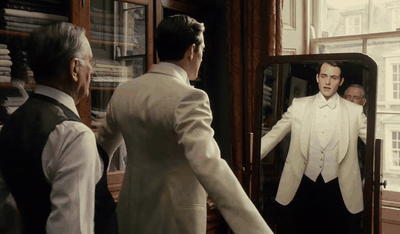

<div align="center">


# Soundwich

### Video Generation with Layered and Controllable Audio

<a href="https://arxiv.org/abs/XXXX.XXXXX"></a>
<a href="https://soundwich.avdemo.workers.dev/"></a>
<a href="https://pub-238c8a4431a4476c8eb0f5bd97a3846e.r2.dev/media/demo/20260926/video.mp4"></a>
<a href="LICENSE"></a>


</div>

Joint audio-video models synthesize a video with **one mixed soundtrack**. Real audiovisual work keeps speech,
music, effects, and ambience on **separate tracks**. Soundwich is a **training-free** method that turns a frozen joint
audio-video model into a generator of multiple synchronized audio stems around one shared video. You control what
each source sounds like and when it plays. The result can then be retimed, muted, replaced, or remixed one stem at a time.

<div align="center">

<a href="https://pub-238c8a4431a4476c8eb0f5bd97a3846e.r2.dev/media/demo/20260926/video.mp4">
  
</a>

<sub>▶ <b>Watch the demo video</b> (with sound) · more examples with per-stem playback on the <a href="https://soundwich.avdemo.workers.dev/">project page</a></sub>

</div>

## Gallery

<sub>Silent previews. Every clip below was generated as separate audio stems plus one video. Listen to the stems on the <a href="https://soundwich.avdemo.workers.dev/">project page</a>.</sub>

<table>
  <tr>
    <td align="center" width="33%"><br><sub><b>Neon Biology Lab</b> · LTX-2.5<br>scientist, android, dog, cat</sub></td>
    <td align="center" width="33%"><br><sub><b>Clockwork Airship</b> · LTX-2.5<br>door knock, footsteps, guitar, captain</sub></td>
    <td align="center" width="33%"><br><sub><b>Crystal Court Violin</b> · LTX-2.5<br>ruler, guard, violin</sub></td>
  </tr>
  <tr>
    <td align="center" width="33%"><br><sub><b>The Unrented Room</b> · MiniMax H3<br>three voices, piano, trumpet, rain, fire, clock, knocks</sub></td>
    <td align="center" width="33%"><br><sub><b>The Last Button</b> · MiniMax H3<br>two speakers, viola, street ambience</sub></td>
    <td align="center" width="33%"><br><sub><b>Ticket Counter</b> · Ovi 1.1<br>passenger and clerk, scheduled turns</sub></td>
  </tr>
</table>

## How it works

Soundwich runs inside the sampler of a frozen model. No weights are trained or fine-tuned.

| | Component | What it does |
|---|---|---|
| 🍞 | **Stem formation** | Expands the single audio trajectory into *N* source stems that share one video trajectory. Each stem gets its own source prompt and a source-specific negative prompt that excludes competing sounds. |
| ⏱️ | **Carrier replay** | Replays cached *activation* and *quiet* attention features inside and outside each source's requested time windows, so every stem follows its timeline. |
| 🥬 | **Scene broadcast** | An internal scene stem gathers the shared acoustic context from all sources, then broadcasts it back so separately generated stems still sound like one room. |
| 🎯 | **Entity routing** | SAM 3 masks connect each stem to its on-screen source in audio-to-video and video-to-audio attention, so the right person's lips move with the right voice. |

## Supported backbones

| Backbone | Separate stems | Source-specific guidance | Timeline control | Scene broadcast | Entity routing | Folder |
|---|:---:|:---:|:---:|:---:|:---:|---|
| [LTX-2.5](https://github.com/Lightricks/LTX-2) | ✅ | ✅ | ✅ | ✅ | ✅ | [`ltx-2.5/`](ltx-2.5) |
| [MiniMax H3](https://github.com/MiniMax-AI/MiniMax-H3) | ✅ | ✅ | ✅ | via shared video¹ | ✅ | [`minimax-h3/`](minimax-h3) |
| [Ovi 1.1](https://github.com/character-ai/Ovi) | ✅ | ✅ | ✅ | — | — | [`ovi-1.1/`](ovi-1.1) |

<sub>¹ H3 attends jointly over text, video, and audio. Shared video features already carry scene context between sources, so no separate scene stem is used.</sub>

Each folder is self-contained: `setup.sh` fetches the upstream model code at a pinned commit, and one command runs
the full method on the included example scene.

## Quick start

<!-- QUICKSTART -->

## Describing a scene

A scene file lists the visual prompt, the sound sources, and when each source should be active. Abridged example:

<!-- SCENE_EXAMPLE -->

## Repository layout

<!-- LAYOUT -->

## Citation

```bibtex
@article{soundwich2026,
  title   = {Soundwich: Video Generation with Layered and Controllable Audio},
  author  = {TBD},
  journal = {arXiv preprint arXiv:XXXX.XXXXX},
  year    = {2026}
}
```

## License and acknowledgements

The Soundwich code is released under the [Apache 2.0 License](LICENSE). It builds on
[LTX-2](https://github.com/Lightricks/LTX-2), [Ovi](https://github.com/character-ai/Ovi),
[MiniMax H3](https://github.com/MiniMax-AI/MiniMax-H3) via [🤗 Diffusers](https://github.com/huggingface/diffusers), and
[SAM 3](https://github.com/facebookresearch/sam3). The upstream code and model weights are fetched separately and remain under their own
licenses and terms of use. Please review them before use.
